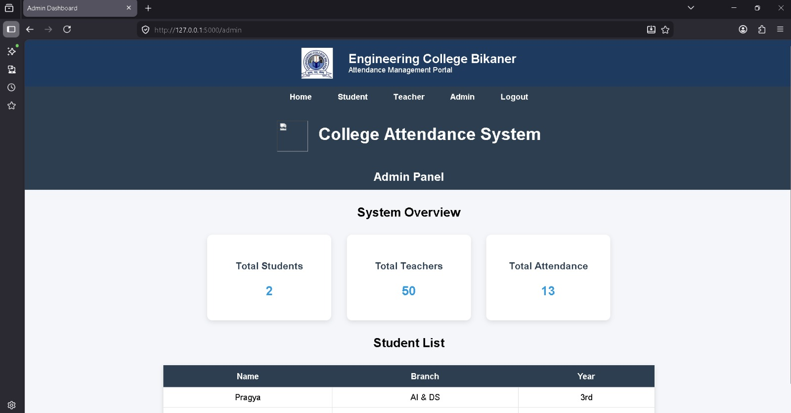
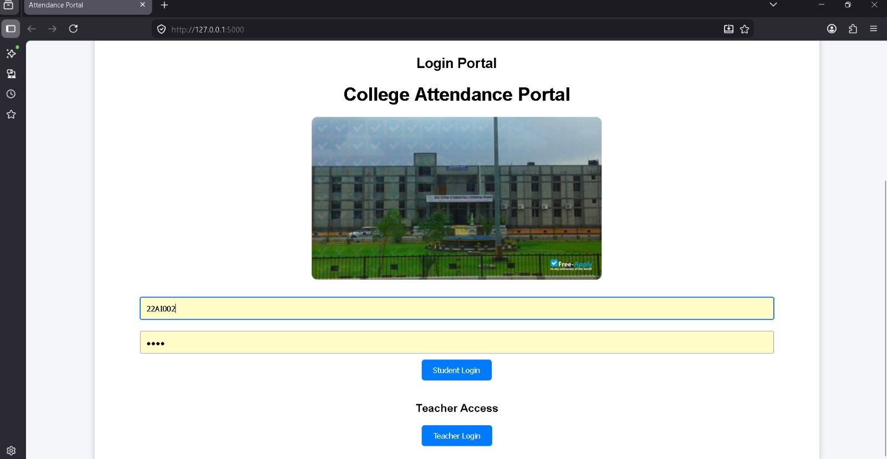
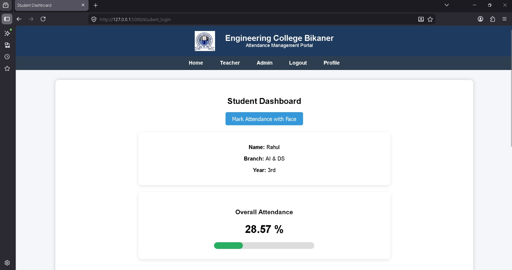
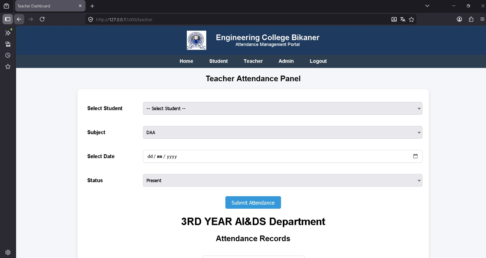
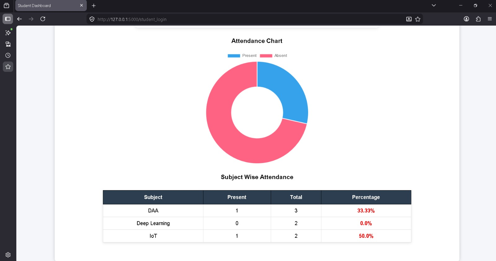

# Smart Attendance System using Computer Vision

An AI-assisted attendance management system developed using Python, Flask, OpenCV, and SQLite to automate student attendance tracking using computer vision and facial recognition techniques.

The system provides separate dashboards for students and teachers, attendance analytics, and real-time attendance management through a user-friendly web interface.

---

## Features

* Face detection and attendance processing using OpenCV
* Automated attendance marking system
* Flask-based web application
* Student and Teacher dashboards
* Attendance analytics and charts
* SQLite database integration
* Real-time attendance management
* User-friendly interface

---

## Technologies Used

* Python
* Flask
* OpenCV
* NumPy
* SQLite
* HTML/CSS

---

## Project Structure

```bash id="2u4v6p"
├── screenshots/
├── static/
├── templates/
├── app.py
├── database.db
├── requirements.txt
└── README.md
```

---

## Installation & Setup

### 1. Clone the Repository

```bash id="5y3n1r"
git clone https://github.com/pragyakanwar/Student-attendance-system.git
```

### 2. Navigate to the Project Folder

```bash id="4j7f9q"
cd Student-attendance-system
```

### 3. Install Dependencies

```bash id="8d2v4t"
pip install -r requirements.txt
```

### 4. Run the Flask Application

```bash id="3w8m2n"
python app.py
```

---

## System Modules

### Student Dashboard

* View attendance records
* Track attendance percentage
* Access attendance analytics

### Teacher Dashboard

* Manage student attendance
* Monitor attendance reports
* View subject-wise attendance statistics

---

## Project Screenshots

### System Overview



### Login Panel



### Student Dashboard



### Teacher Attendance Panel



### Attendance Analytics Chart



---

## Future Improvements

* Face recognition integration
* Cloud database support
* Email notifications
* Export attendance reports in Excel/PDF
* Deployment on cloud platforms
* Admin authentication system

---

## Author

Pragya Kanwar
B.Tech – Artificial Intelligence & Data Science
